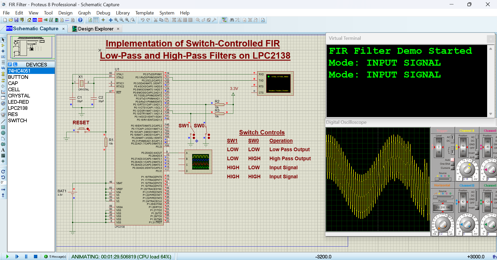
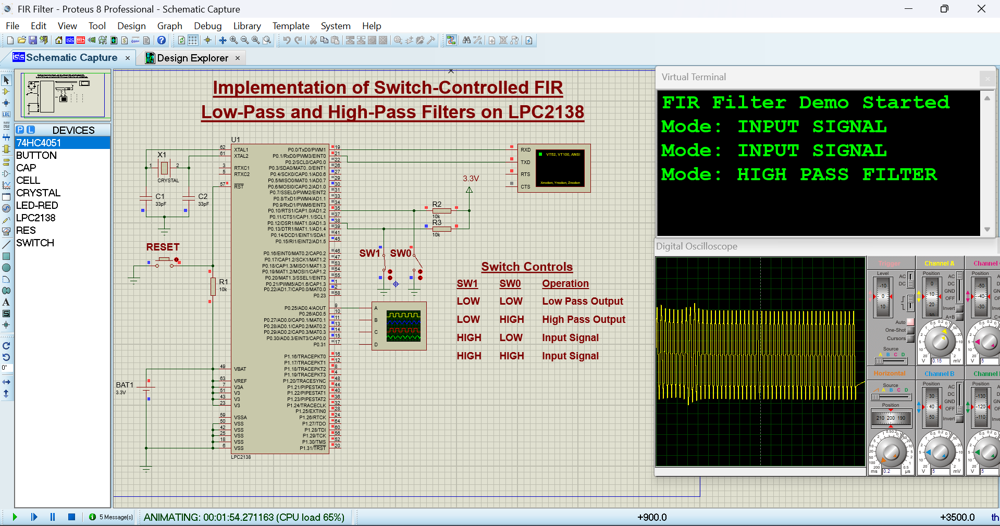
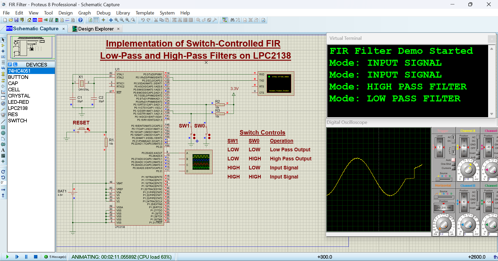

# ECN15252-MiniProject-FIR-Filter

Implementation of Switch-Controlled FIR Low-Pass and High-Pass Filters on LPC2138 using **Proteus Simulation**

# Switch-Controlled FIR Filtering on LPC2138

## Course
Advanced Microcontrollers

## Project Description
This project implements **Finite Impulse Response (FIR) digital filters** on the **LPC2138 ARM7 microcontroller**, simulated using **Proteus**. Two hardware switches are used to select between the **original input signal**, **low-pass filtered output**, or **high-pass filtered output**. The selected signal is routed to the **DAC** and observed on a virtual oscilloscope in Proteus. UART messages indicate the current operating mode.

## Features
- FIR Low-Pass and High-Pass filtering
- Switch-based mode selection (P0.10 and P0.12)
- DAC output for waveform visualization in Proteus
- UART status messages on virtual terminal
- Implemented in Embedded C using LPC2138 registers

## Switch Configuration
| P0.12 | P0.10 | Mode |
|------|------|------|
| 0 | 0 | Low-Pass Filter Output |
| 0 | 1 | High-Pass Filter Output |
| 1 | 0 | Original Input Signal |
| 1 | 1 | Original Input Signal |

*(Switches are active-low)*

## Hardware / Simulation Environment
- LPC2138 Microcontroller (Proteus)
- Virtual Oscilloscope (Proteus)
- Virtual Serial Terminal (UART)
- Two push-button switches
- DAC output pin (P0.25)

## Software Requirements
- Keil µVision (for code development and HEX file generation)
- Proteus Design Suite (for simulation)

## Signal Description
The input signal is generated in software as a combination of:
- A low-frequency sine wave
- A high-frequency sine wave

This allows clear observation of the filtering effect when switching between modes.

## How It Works
1. The input signal is generated internally in software.
2. Switch states are read by the LPC2138.
3. Based on switch combination, the appropriate mode is selected.
4. FIR filtering is applied for low-pass or high-pass modes.
5. The selected signal is output via the DAC and displayed on the oscilloscope.
6. UART displays the current mode in the terminal.

## Notes
- FIR filtering is implemented using block-based processing.
- A small delay is used to control the DAC update rate.
- Mode switching is not instantaneous due to buffer-based signal processing.

## Future Enhancements
- Implement **interrupt-driven DAC timing** using timers for precise and consistent sampling rates.
- Replace the internally generated signal with a **real-time ADC input** for live signal acquisition.
- Optimize the FIR algorithm for **sample-by-sample real-time processing**.
- Add additional filter types such as band-pass or band-stop filters.

## Simulation Results

This section shows the results obtained from the Proteus simulation, including
the circuit setup and waveform outputs observed on the Scope.

### Original Input Signal

### Low-Pass Filter Output

### High-Pass Filter Output

